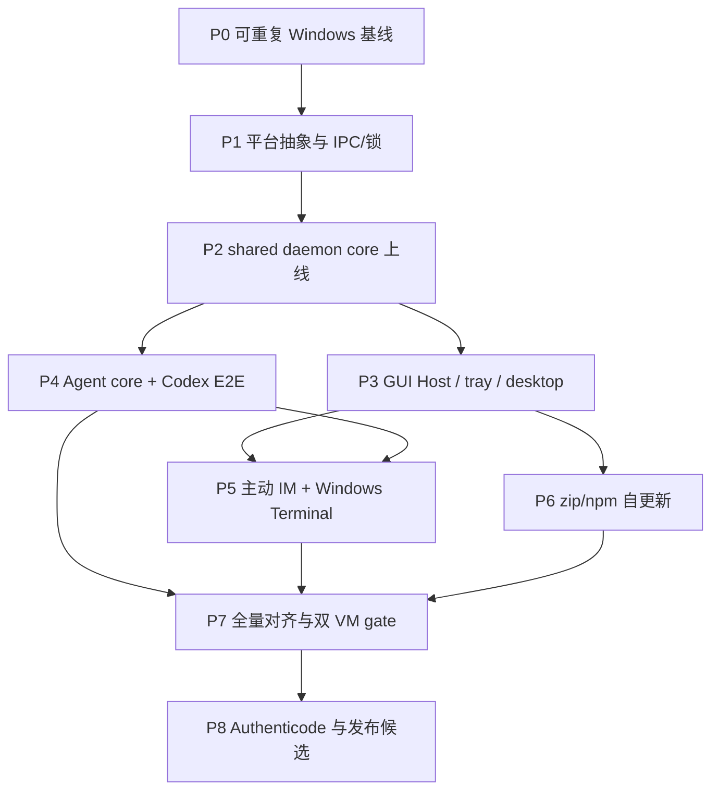

# Windows 平台功能与架构对齐实施计划

对应规格：[`../specs/windows-platform-parity.md`](../specs/windows-platform-parity.md)

状态：**P0–P6 与代码级 P7/P8 已实现；等待外部发布验收**

策略：长期开发分支，小提交、阶段 gate，完整验收后一次合并主线

## 1. 实施原则

1. 先修可重复基线，再抽平台边界；不在红色 Windows 测试集上直接大改 daemon。
2. 抽取一个 shared core，不复制 `windows_impl` 业务实现。
3. 每阶段同时完成代码、自动测试、Windows VM smoke 和文档记录；阶段完成不代表可提前发布。
4. 安全边界（pipe ACL、peer/session、permission identity、update rollback）与功能同时实现。
5. Win11 VM 持续验证；Win10 22H2 VM 在发布候选阶段加入正式 gate。
6. 只在所有本地功能验证通过后配置 Authenticode；原生安装器、ARM64、多会话留到后续项目。

## 2. 阶段依赖

P3、P4、P6 在 P2 完成后可以由不同开发者并行，但共享文件变更必须先约定 adapter 接口；本计划不要求
为了并行创建第二份业务状态机。

## 3. P0：建立可信 Windows 基线

目标：让 Windows 安装、测试和 CI 先能稳定暴露真实问题。

### 工作项

- 修复 `scripts/build-frontend-if-needed.mjs` 在 Node 24/Windows 对 `pnpm.cmd` 的调用：
  - 优先解析/执行实际 JS entry 或显式调用 `cmd.exe /d /s /c` 与固定参数；
  - 不把 workspace path 或用户输入插进未转义 shell string；
  - 为 `.cmd` resolver 增加 Windows unit test。
- 审计 `scripts/install-windows.ps1`：
  - 同时兼容 Windows PowerShell 5.1 与 PowerShell 7；
  - 处理 UTF-8/BOM、路径含空格/中文、错误码传播、重复安装；
  - 安装失败不得留下半写入 binary 或 PATH 配置。
- 把当前 27 个 Windows Rust test failures 分类并逐项修成：
  - 跨平台有效的测试改用 `tempdir`/native paths 与平台中立 fixture；
  - 真正 Unix-only 的行为明确放入 Unix adapter tests；
  - Windows 必须支持的 permission/process/path 行为新增 Windows expectation，不能简单 `cfg` 掉。
- 清理当前 12 个 Windows 编译 warning；新增 warning budget（新 warning 阻断）。
- 扩充 `.github/workflows/build.yml` 的 Windows job：
  - 前端 Vitest 与 build；
  - Rust tests；
  - release build；
  - Windows 可用的 fmt/lint/clippy；
  - 保留 artifact 供后续 smoke。
- 新增 Windows baseline 脚本/记录模板，输出 OS build、PowerShell、Node、pnpm、Rust、WebView2、commit、
  测试摘要，不记录 secret。

### Gate P0

- Win11 VM 上 `install-windows.ps1` 通过，安装出的 `AskHuman.exe version` 可运行。
- Windows CI 全绿；已知功能不支持可以有明确测试，但不能靠 no-op/skip 隐藏。
- 现有 Linux/macOS CI 无回归。

## 4. P1：收敛平台抽象，落地 Windows IPC 与锁

目标：先建立 shared core 可以依赖的稳定 OS seam。

### 4.1 IPC transport

- 将 `ipc/transport.rs` 拆为 platform-neutral facade 与 Unix/Windows backend。
- 定义统一的 connect/listen/accept/split/shutdown/peer API；reader/writer 可用 trait object、enum wrapper
  或 generic，但不得让业务模块继续引用 `OwnedReadHalf`/`OwnedWriteHalf`。
- Windows daemon 与 GUI Host 分别使用 Tokio named pipe：
  - byte mode承载现有 NDJSON；
  - server 预建下一 instance；
  - client 对 busy/not-found 做有界重试并触发 daemon spawn；
  - endpoint 由当前 user/logon identity + normalized `config_dir()` hash 组成；
  - 禁止 remote client，设置当前用户 ACL，并记录可测试的 security descriptor。
- 把 version handshake、oversized/malformed frame、half-close、timeout、concurrent clients 做成跨平台
  contract tests。

### 4.2 单例与数据锁

- 建立 `platform::lock`：
  - Unix 保持现有 flock 语义；
  - Windows 用 named mutex/`LockFileEx` 实现 owner、try-lock、abandoned recovery、RAII release；
  - key 包含 AskHuman 实例分区，Dev Instance 不相互阻塞。
- 盘点并迁移所有 Windows no-op lock：daemon/GUI Host singleton、todo、history、update、integration 与
  其他 read-modify-write 路径。
- 明确 lock ordering，增加并发/崩溃恢复 tests，避免 daemon 与 updater 死锁。

### 4.3 进程启动基础

- 建立 Windows spawn helper，集中处理 `DETACHED_PROCESS`、`CREATE_NEW_PROCESS_GROUP`、
  `CREATE_NO_WINDOW`、stdio inheritance 与 argv quoting。
- CLI 本身保留 console I/O；daemon/helper/GUI Host 不弹额外 console。
- 增加后台 child readiness、早退、exit-code 与日志重定向测试。

### Gate P1

- Windows 原生 integration test 可并发连接 daemon-test server 与 GUI-test server。
- 非当前用户/错误实例 endpoint 无法访问；同一实例只能有一个 owner。
- 强杀 test owner 后，新进程可恢复 pipe 和 locks。
- Unix IPC/lock/spawn tests 继续通过。

## 5. P2：抽取 shared daemon core，接通 Windows 数据面

目标：消除 `daemon/unix_impl` 作为业务实现边界，让 Windows 首次运行完整 daemon。

### 5.1 先固化行为

- 为当前 Unix daemon 建 characterization tests，至少覆盖：
  - hello/version/restart；
  - ask/cancel/timeout/coalescing/dedupe；
  - pending ownership 与 agent registry；
  - channel connect/reconnect/config watch；
  - graceful drain 与 update state；
  - malformed client 与 backpressure。
- 把平台差异替换为注入的 transport、lock、process、spawn、clock/filewatch adapter。

### 5.2 机械抽取与接线

- 把请求路由、state、IM routers、Agent registry、config watcher、drain/update coordination 从
  `daemon/unix_impl` 移到 `daemon/server`/`daemon/runtime`。
- Unix adapter 先切到 shared core 并保持行为不变，再接 Windows adapter；避免同时重写两端。
- 将 `client/mod.rs`、`main.rs` 和 ask path 改为 cross-platform；移除不合理的 `cfg(unix)` compile gate。
- Windows daemon 实现懒启动、readiness/version handshake、日志、crash recovery 与 binary-change restart。
- 登录启动使用 per-user、non-elevated Windows mechanism；install/enable/disable/uninstall 幂等。具体选
  HKCU Run、Startup shortcut 或 Task Scheduler 前，做一个最小 spike，按无 UAC、可清理、GUI session
  归属和签名后的稳定性选型，并把决定补进 spec。
- 让四个 IM channel router 在 Windows daemon 中按相同单连接规则运行；通过 deterministic mock IM
  测试，不要求此阶段使用真实外部消息服务。

### 5.3 暂时切换策略

- 开发分支可用内部 env/diagnostic flag 对照旧 fallback；默认开发构建逐步切到 daemon。
- 不允许新旧路径同时写 history/todos/integration state。
- 在 P7 前保留一键诊断回退；P7 删除产品级 fallback。

### Gate P2

- Win11 上 `daemon start/status/stop/restart`、自动拉起和 login restart 通过。
- CLI ask 走 named pipe daemon，mock channel 完成请求/回答/取消/超时/去重。
- 两个并发 CLI 不会创建两个 router 或损坏共享状态。
- `doctor --json` 对 daemon/channel 使用运行时状态，不再报告 `windows_daemon_unsupported`。

## 6. P3：GUI Host、托盘与桌面体验

目标：把已有桌面功能接入 Windows GUI Host。

### 工作项

- 把 GUI Host server/client 抽到 shared core + IPC adapter，Windows 使用独立 secure named pipe。
- 移除 tray 模块的整体 `cfg(unix)`；保留真正 macOS/Linux-specific 的菜单或 API 分支。
- 接通窗口单例和路由：question popup、history、settings、todos、Agents console、new task、fork、
  interject。
- 验证并适配 popup prewarm、focus arbitration、窗口置前、pin、find、composer、快捷键和多窗口行为。
- 建立 Windows login GUI Host 启动/退出语义；daemon 与 GUI Host 分离，后台 IM 不依赖窗口常驻。
- 实现 Windows system sound；用户 hook 支持 `.exe`/PowerShell/批处理的安全 argv 形式，保留超时、
  stdout/stderr 限制与失败隔离。
- 明确 WebView2 bootstrap：正式支持系统应能自动满足或给出可执行的安装提示，不把空白窗口当作成功。
- 为 Windows 的 DPI、多显示器、深浅主题、输入法、剪贴板、文件附件路径建立人工矩阵。

### Gate P3

- Win11 本地交互矩阵中的所有窗口可打开、复用、聚焦、关闭和从 tray 恢复。
- daemon 单独运行时不弹 console，退出 tray 后按产品定义保留或停止 daemon。
- popup 全流程在 WebView2 下完成，截图/日志记录无 layout blocker。
- 登录/注销、睡眠/恢复、GUI Host 强杀均可自动恢复且不丢 pending request。

## 7. P4：Windows 进程识别与 Codex 真机集成

目标：恢复 Agent lifecycle/permission/stop/interject 的安全证据链，并完成 Codex E2E。

### 7.1 Process inspector

- 定义统一接口：liveness、parent chain、exe、command line、session、creation identity、workspace hints。
- Windows backend 使用 Windows API/Rust crate；评估 Toolhelp snapshot + query process information，必要时
  限定权限和缓存。高频 hook 不启动 PowerShell/WMI 子进程。
- 实现 Windows path identity：drive/UNC、case-insensitive component、separator、long path、symlink/junction、
  不存在 path 和拒绝访问；不确定时 fail closed。
- 修复当前 context binding、workspace recovery、permission rules/memory 测试，用 platform-neutral fixture
  加 Windows-specific cases。

### 7.2 Hooks 与 Agent 状态机

- 移除 capability 的 `cfg!(unix)` 判定，改为 adapter capability + 版本/schema 检测。
- Codex：
  - 以当前安装版官方 schema 为准，生成 Windows hook command（如 `commandWindows`）；
  - 重新对拍 user/project/managed 层叠与 trust；
  - identity hash/verification 纳入 Windows command fields；
  - 覆盖路径空格、中文、PowerShell 5/7、直接 exe 调用与 stderr。
- Claude/Cursor：用可执行 `.exe`/直接 argv 或 Windows PowerShell 脚本替代 `.sh` 假设，配置写入必须
  format-preserving、可回滚。
- Grok：为 Windows process/project partition 与 context claim 增加模拟进程树测试。
- 所有 Agent 共用 lifecycle/registry/pending/watchdog core，不为 Codex 新建特例状态机。

### 7.3 Codex 真实 E2E 矩阵

在 Win11 VM 安装受支持 Codex 版本后验证：

1. 首次安装/更新 hooks 与用户确认；
2. SessionStart/SessionEnd 和异常终止；
3. AskHuman 自由文本/选项/附件/取消/超时；
4. compaction 后 `show_last` 恢复；
5. permission remember 的 session/project/user 层级与危险命令 fail closed；
6. stop confirmation 与 interject；
7. 两个 workspace、同名 task、并发 session 的归属隔离；
8. daemon/GUI Host/Codex 分别重启后的恢复。

### Gate P4

- Windows Agent 相关 test 全绿，非 Windows Agent tests 无回归。
- `doctor --json` 显示 Codex 的 installed/configured/live/verified 等分层事实。
- Codex Win11 E2E 全部通过并有版本、commit 和日志摘要；Claude/Cursor/Grok 明确标记为 simulated，
  不宣称真实 E2E。

## 8. P5：主动 IM 命令与 Windows Terminal

目标：补全由 daemon/GUI Host/Agent registry 支撑的主动控制面。

### 工作项

- 建立 `platform::terminal::windows`：
  - 首选 `wt.exe`，明确 PowerShell profile/shell 选择；
  - 精确 argv quoting，cwd/path 含空格与中文；
  - 无 Windows Terminal 时给出支持的 fallback 或清晰安装提示；
  - 启动后等待 Agent lifecycle ready，超时可诊断并清理 pending launch。
- 接通 GUI new task/fork 与 IM `/new`、`/fork`。
- 逐个验证 `/status`、`/watch`、`/msg`、`/yolo`、`/diff`、`/stage`、`/transcript`、`/todo`，
  对 git、shell 和路径的 Windows 差异建立 tests。
- 验证四渠道只保留一个 router、active command permissions、request origin、always-respond 和断线恢复。
- 外部 IM 不适合 CI 的部分用 deterministic mock；至少选一个已配置测试渠道做 Win11 真实 smoke，渠道
  凭据不写入日志/fixture。

### Gate P5

- Win11 上从 tray/GUI/IM 启动与分叉 Codex task，registry 能正确追踪且可交互。
- 全部主动命令在 Windows 返回与 Unix 相同的结构和错误类别。
- 并发启动、超时、终端缺失、workspace 不存在、路径含特殊字符均有确定性结果。

## 9. P6：zip/npm 安装、升级与回滚

目标：让当前两种分发方式在 daemon/GUI Host 常驻条件下可靠维护。

### 9.1 Windows updater worker

- 设计单二进制的 updater role：先把当前/新 binary 的受信任 worker 放入实例专用临时目录，再从目标
  路径之外运行。
- 更新事务：验证 artifact → 请求 daemon/GUI Host/helpers drain → 等待 handles 释放 → 创建备份 →
  原子/可恢复替换 → 验证新版本 → 恢复原运行状态 → 清理。
- 失败时恢复 `.bak` 并保留诊断；重启中断时下次启动能判断并完成或回滚，不循环更新。
- 校验下载内容、版本/通道与签名接口；即使 P8 才注入真实证书，P6 就必须保留 sign/verify stage。

### 9.2 npm 与脚本

- npm updater 不在被覆盖的 package `.exe` 内直接执行：交给临时 worker/外部 launcher，待所有相关
  进程释放 package 后调用安全的 Windows npm command。
- 统一 `.cmd`/`.bat` process helper，覆盖 Node 24 和路径/参数 escaping；禁止复用 shell string 拼接。
- 验证 zip 解压运行、npm global install/update/uninstall、PATH 更新、两个 PowerShell 版本、非管理员用户。
- 提供显式 cleanup/uninstall 命令或脚本，移除 login entry、stale pipe/mutex state、托管 hooks 与临时
  updater；用户数据是否保留按现有产品语义并清楚提示。

### Gate P6

- Win11 完成 zip→新版 zip、npm→新版 npm、失败回滚、进程占用、网络中断、重复执行矩阵。
- 更新期间新 ask 请求得到 drain/retry 语义，不静默丢失。
- 卸载/清理后没有自启动孤儿进程或指向不存在 binary 的 Agent hooks。

## 10. P7：全量 cutover、回归与双 VM 发布 gate

目标：证明“功能与架构对齐”，并移除临时兼容路径。

### 10.1 Cutover

- Windows 所有公开入口默认且只走 shared daemon/GUI Host path。
- 删除产品级 single-process fallback、Unix-only capability matrix 和已失效的 unsupported 文案。
- 保留只用于排障的显式内部 opt-out 时，文档标明不保证功能且不能出现在常规 UI。
- 对 `cfg(unix)`/`cfg(not(unix))` 做一次全仓审计；每个残留必须属于真实 OS adapter 或平台专属功能。

### 10.2 Windows 10 VM

- 准备 Windows 10 22H2 x64、普通本地用户、最新可用 WebView2 的干净 VM。
- 记录可复建配置和快照边界，不复制 Win11 VM 的已安装状态。
- 执行与 Win11 相同的核心矩阵；旧 Win10 版本只做机会性 smoke，不纳入 blocker。

### 10.3 全量矩阵

- 自动：三平台 full suite、Windows adapter stress、协议兼容、update fixture、release artifact smoke。
- 桌面：tray/窗口/WebView2/DPI/多屏/输入法/文件选择/通知/系统声音/login。
- daemon：并发、崩溃、睡眠、注销、binary replace、配置热更新、channel reconnect、graceful drain。
- Agent：Win11 + Win10 Codex E2E，版本升级/降级与 hooks repair。
- 分发：两种渠道 clean install/update/rollback/cleanup。
- 性能：hook 热路径、daemon idle、popup warm/cold、pipe connect 不出现明显平台级回退。
- 安全：pipe ACL/remote denial、cross-instance/cross-user、hook identity、path forgery、update verification、
  secret/log redaction。

### 10.4 文档与审查

- 更新 `docs/overview.md` 中平台支持、daemon/GUI Host 和安装/更新入口；只改已经因实现而不准确的段落。
- 更新相关 daemon、Agent、self-update、tray specs，不复制相互冲突的规则。
- 在本计划附实施记录：commit、CI run、两台 VM 日期/版本、矩阵结果、已知限制。
- 审查长期分支相对主线的完整 diff；分阶段处理 review 意见后再一次合并。

### Gate P7

- 规格 WP-01～WP-11 除“签名”子项外均有可追踪证据。
- Win11 与 Win10 22H2 矩阵无 blocker；所有非 blocker 有 owner、解释与后续项。
- macOS/Linux 无功能或性能回归。
- 产品中没有错误展示为 unsupported 的 Windows 对齐功能。

## 11. P8：最后配置 Authenticode 并形成发布候选

目标：按已确认顺序，在功能和本地验证完成之后才接入生产签名。

### 工作项

- 选择组织/个人适用的 code-signing certificate 与硬件/云密钥托管，确认 CI 可用而不导出长期私钥。
- 在现有 release workflow 的 artifact assembly 前签名 Windows `.exe`；zip 与 npm platform package 必须
  装入同一个已签名 binary，不能打包后产生未签名副本。
- 使用可信 timestamp 服务；记录证书轮换、过期、timestamp 故障与紧急回滚流程。
- CI 阻断验证：签名存在、subject/issuer/时间戳符合策略、artifact hash 与 manifest 一致；发布后从
  zip/npm 各抽样再次验证。
- 在两台 VM 上验证 SmartScreen/下载/解压/首次执行体验并记录结果。签名不能代替功能测试，也不能
  扩大 P7 已冻结的代码范围。
- 原生 installer 另立 spec/plan，不在本阶段追加。

### Gate P8 / 完成

- release candidate 的 Windows zip 与 npm binary 签名验证通过。
- 所有 CI、Win11、Win10 22H2 gate 重跑通过；签名步骤没有改变 binary 功能或更新链。
- 更新发布文档和支持矩阵；删除 `docs/PROGRESS.md` 的本实施项，将 ARM64/installer/RDS 等另列后续。
- 长期开发分支完成最终 review 后一次合并主线。

## 12. 测试矩阵最低集合

| 层级 | 自动化 | Win11 VM | Win10 22H2 VM |
|---|---|---|---|
| install/build | PS5/PS7、Node 24、CI release | zip + npm | zip + npm |
| IPC/lock | native integration + stress | crash/sleep/concurrency | smoke + concurrency |
| daemon/channels | shared contracts + mock IM | full lifecycle + one real channel smoke | full lifecycle smoke |
| GUI/WebView2 | frontend tests | full UI/DPI/multi-monitor | core UI/WebView2 |
| Codex | config/process fixtures | full real E2E | full release E2E |
| 其他 Agent | schema + simulated process tree | install/config smoke if available | 非 blocker |
| active commands | mock channel integration | full command matrix | core command matrix |
| update | fixture/failure injection | full zip/npm/rollback | release upgrade/rollback |
| security | ACL/path/identity/update tests | cross-instance/non-admin | non-admin/signature |
| signing | artifact verify | installed artifact verify | installed artifact verify |

每次 VM 记录必须包含：OS build、AskHuman commit/version、Agent version、安装来源、测试日期、执行者、结果、
日志位置和偏差。敏感凭据只记录“已配置”，不得进入仓库。

## 13. 建议提交序列

长期分支内建议按以下 Conventional Commit 粒度推进，实际 scope 可随模块调整：

1. `fix(build): support node 24 command shims on windows`
2. `test(windows): establish native ci baseline`
3. `refactor(ipc): separate transport from daemon protocol`
4. `feat(daemon): add secure windows named-pipe transport`
5. `feat(daemon): add windows lifecycle and cross-process locks`
6. `refactor(daemon): move server logic into shared core`
7. `feat(popup): add windows gui host and tray support`
8. `feat(agents): add windows process inspection and codex hooks`
9. `feat(channels): enable active windows task control`
10. `feat(update): add transactional windows self-update`
11. `test(windows): add win10 and win11 release gates`
12. `build(release): sign windows artifacts`

提交主题进入 release notes 的类型应与真实用户影响一致；纯机械移动用 `refactor`，不要把重构噪声变成
用户 changelog。

## 14. 第一批可执行任务

P0 启动时按以下顺序工作：

1. 从主线建立 `codex/windows-platform-parity` 长期分支，并确认 Win11 VM 使用同一分支/commit。
2. 为 Node 24 `.cmd` 问题添加最小失败测试，修复前端构建 helper。
3. 在 PS5 与 PS7 各跑一次 installer，修复编码/错误传播并记录 baseline。
4. 给 27 个 Windows Rust failures 建 issue/checklist 映射，先修 path/temp fixture，再处理 Agent/permission
   语义；每一类都必须说明是跨平台 bug、adapter 缺失还是错误测试假设。
5. 让 Windows CI 运行完整 tests，再把它设为分支保护 gate。
6. P0 通过后，先提交 IPC facade 的只重构版本，再加入 named pipe；不要把 core 抽取与 transport 新实现
   混在同一 commit。

## 15. 回滚与范围控制

- P0～P6 只在开发分支内推进，不把半成品 Windows capability 发布到主线。
- 每个阶段保留前一阶段可运行 commit/tag；数据 schema 变更必须向后兼容或提供 migration/rollback。
- 若 shared core 抽取导致 Unix characterization tests 变化，先停止并定位，不用 Windows 分支逻辑修补
  Unix 语义。
- 新事实若要求改变已确认的 OS、Agent、分发、签名或会话范围，先更新规格并取得确认，再改计划。
- Authenticode 之后只接受签名/打包修复；任何功能性代码变化都返回 P7 重跑双 VM gate。

## 16. 实施记录（2026-08-15）

### 16.1 已完成范围

- 分支：`codex/windows-platform-parity`；实现基线 `b216b333`，本记录对应 `0f76bf7`。
- P0：修复 Node 24 在 Windows 直接 spawn `.cmd` 的 `EINVAL`，Windows CI 现运行 pnpm/Vitest、
  Node tests、Rust tests、Clippy 与 release build；安装脚本兼容 Windows PowerShell 5.1 和 PowerShell 7。
- P1–P2：CLI、hooks、GUI 与 IM 全部切到 shared daemon core；Unix socket / Windows byte-mode named
  pipe 位于同一 transport 抽象。named pipe 名称按当前 SID、Windows session 与规范化配置目录隔离，
  使用受保护 DACL（当前用户 + LocalSystem）并拒绝远程客户端。跨进程锁、后台启动、HKCU Run 与
  native process identity 均有 Windows adapter，不保留产品级 single-process fallback。
- P3：Windows GUI Host、托盘、设置/历史/待办/Agent/Interject/新建任务/Fork 单窗路由与 daemon 状态
  订阅已启用；system sound 使用 `MessageBeep`；用户 hooks 支持 `.exe/.ps1/.cmd/.bat`、10 秒边界和
  stdout/stderr 隔离。
- P4：四家 Agent lifecycle/context/stop/subagent/permission 集成在 Windows 可安装和修复。Codex 生成
  `commandWindows` 并按 Windows 实际命令写 trusted hash；进程发现用 Toolhelp、
  QueryFullProcessImageName、NtQueryInformationProcess、ProcessIdToSessionId 与 GetProcessTimes，hook
  热路径不启动 PowerShell/WMI。Claude/Cursor timeout hook 生成 PowerShell 5 兼容脚本。Codex shell
  permission memory 使用保守 PowerShell literal parser；变量、替换、重定向、分组、调用运算符和歧义
  形式全部 fail-closed 回基础审批。
- P5：主动 IM command 与 Agent 控制台能力复用 shared daemon；新建/Fork 使用 `wt.exe` direct argv
  打开 Windows Terminal tab，task/cwd/flags 不拼入 shell 字符串，缺少 Terminal 时返回可恢复错误。
- P6：direct 与 npm 更新均使用安装目录外事务 worker，排空 daemon/GUI Host 后备份、替换、校验、
  回滚并恢复原运行角色。Direct asset 先校验 `SHA256SUMS`、版本与 WinVerifyTrust Authenticode；npm
  安全解析并调用 `npm.cmd`。worker 日志轮换，过期临时目录自动清理。
- P7 维护面：增加幂等 `agents cleanup`、`scripts/uninstall-windows.ps1`（默认保留用户数据，
  `-PurgeData` 显式清除）与 `scripts/verify-windows-signature.ps1`；installer 使用 staging + hash +
  `Move-Item` 事务复制，并幂等维护当前用户 `PATH`；uninstaller 只移除对应安装目录。
- P8 代码/CI：release workflow 使用 `azure/artifact-signing-action@v2` 的 OIDC 身份，统一 timestamp，
  并在打包前阻断验证 signer subject 与时间戳。生产 Azure account、certificate profile 和 subject 仍需
  发布环境提供；仓库没有长期私钥。

### 16.2 Win11 VM 证据

环境：Windows 11 Home 24H2 x64、普通用户、Node 24.19、pnpm 10.34.5、Rust 1.97、Windows
PowerShell 5.1、PowerShell 7.6.5。SSH 仅用于构建与自动测试，符合本规格会话边界。

| Gate | 结果 |
|---|---|
| PS5 / PS7 脚本解析 | installer、uninstaller、signature verifier 通过 |
| install | PS5 与 PS7 安装均通过；最终二进制安装到 `%LOCALAPPDATA%\Programs\AskHuman\AskHuman.exe` |
| user PATH | PS5 真实安装自动加入目录；重复添加保持 1 条；临时目录 add/remove 往返不影响其他条目；新进程 `Get-Command AskHuman` 与 `AskHuman --version` 通过 |
| daemon | `daemon start --force` 成功；protocol 2；named pipe endpoint；`agents monitor --json` 返回快照 |
| Rust tests | 1090 tests：1088 passed、0 failed、2 ignored |
| Clippy | `--all-targets -- -D warnings` 通过 |
| frontend / Node | Vitest 160 passed；Node command-shim tests 3 passed；production build 通过 |
| Codex E2E | `codex-cli 0.147.0`、ChatGPT 登录；CLI mode + lifecycle + permission + stop 安装成功；生成 `commandWindows`/trusted hashes；真实 authenticated `codex exec` 返回 `WINDOWS_CODEX_E2E_OK` |
| maintenance | 临时安装目录完整执行 cleanup/daemon stop/remove；目录删除、用户数据保留，随后成功恢复 daemon 与 Codex integration |
| signing negative | 未签名开发 binary 被 verifier 以 `NotSigned` 拒绝，证明 release gate fail-closed |

### 16.3 尚需外部状态的发布 Gate

这些项目不需要继续修改 shared architecture，但在对外宣称“Windows release certified”前必须完成：

1. 新建干净 Windows 10 22H2 x64 VM，复跑 §12 核心矩阵；当前只有 Win11 VM。
2. 在生产 Azure Artifact Signing account/profile 中运行 release workflow，验证 zip 与 npm 内同一已签名
   binary、timestamp、subject、manifest hash，并在 Win11/Win10 记录 SmartScreen 首次运行体验。
3. 在交互式 Windows 桌面手工验收 tray、WebView2、DPI/多屏/输入法、文件选择、声音、登录/注销；
   SSH 会话不能替代视觉/焦点验收。
4. 用至少一个真实 IM 凭据跑主动命令和重连 smoke；自动化已覆盖 mock Router/协议，但测试 VM 未配置
   生产凭据。
5. 对最终签名 release candidate 复跑 direct/npm clean install、upgrade、rollback；开发 binary 因未签名
   会被 direct updater 正确拒绝，不能作为成功更新样本。

ARM64、原生 installer 与 Windows Server/RDS 多会话仍按已确认范围另立项目，不属于上述 release
blocking gate。
